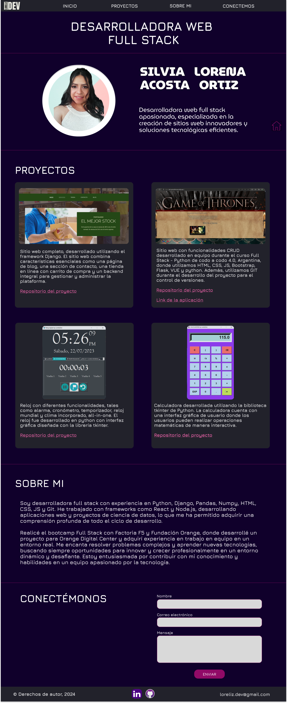
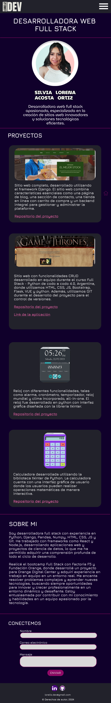

# Portfolio

Este proyecto es un portfolio personal creado como parte del bootcamp de **Factoria F5**. El objetivo es mostrar nuestras habilidades en **HTML y CSS**, siguiendo un diseño inicial proporcionado por un compañero del bootcamp.

El portfolio es una página web que presenta mi perfil profesional, incluyendo una sección sobre mí, mis proyectos y una forma de contacto.

## Diseño Original

El diseño inicial del portfolio fue realizado por [Wilder Aguilar](https://github.com/Wilder-Aguilar) en **Figma**. Aquí puedes ver una vista previa del diseño: [Diseño en Figma](https://www.figma.com/design/HsFjmsyrXtilqOm38Ou0Rd/Portfolio-Lorena?node-id=0-1&t=fql4mahA1Xmw38RD-1)

<div align="center">
    <h3>Versión Desktop // Versión Mobile</h3>
    
    
</div>

## Tecnologías Utilizadas


## Estructura del Proyecto

```
portfolio-F5/
├── index.html
├── styles.css
├── assets/
│   └── img/
│        └──(imágenes utilizadas en el proyecto)
└── README.md
```

## Demo

Puedes ver el portfolio en funcionamiento en el siguiente enlace: **[Portfolio LorelizDev](https://lorelizdev.github.io/portfolio-F5/)**

## Instalación y Uso

Para ver el proyecto localmente, sigue estos pasos:

1. Clona el repositorio:
```
git clone https://github.com/LorelizDev/portfolio-F5.git
```

2. Navega hasta el directorio del proyecto:
```
cd portfolio-F5
```
3. Abre el archivo `index.html` en tu navegador favorito.

## Feedback

Para cualquier consulta, puedes contactarme a través de:

* [Correo electrónico](mailto:loreliz.dev@gmail.com)
* [GitHub](https://github.com/LorelizDev)
* [LinkedIn](https://www.linkedin.com/in/silvia-lorena-acosta-ortiz/)


